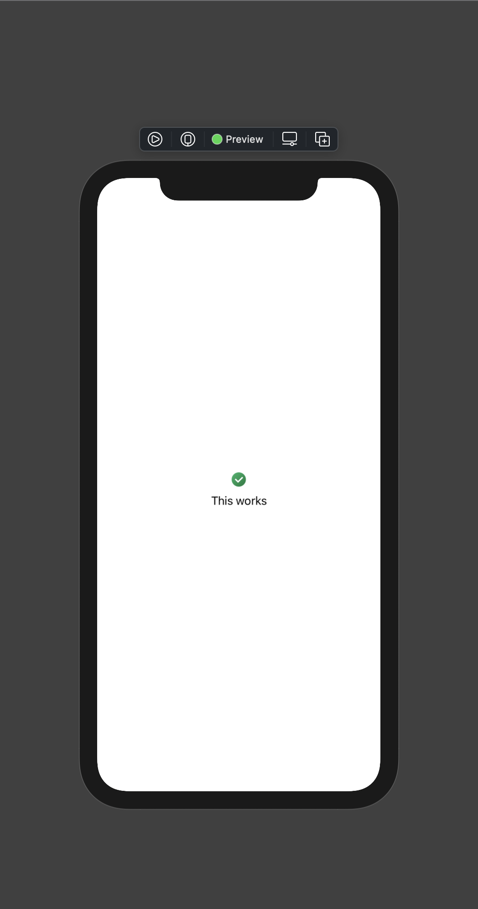
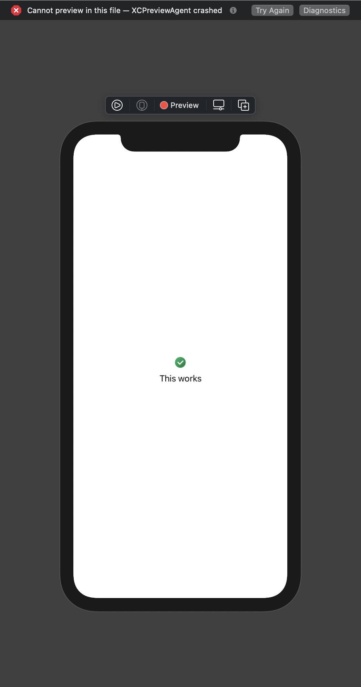

# XCode preview crashes when using resources accessed in another Swift Package

**🚨 For everyone searching for a workaround, there is one!
It's on the [`workaround`](https://github.com/RemiBardon/xcode-preview-spm-resources-bug/tree/workaround) branch.
It's mainly the [`6599c31`](https://github.com/RemiBardon/xcode-preview-spm-resources-bug/commit/6599c31af1c49fe884e2b84149043aee51aca031) commit,
but check the branch, as I might improve it later.**

## Context

- I have a package shared by multiple projects ([MySubLibrary](MySubLibrary/) in this example). It contains localized strings (see [MySubLibrary/Resources/Strings](MySubLibrary/Sources/MySubLibrary/Resources/Strings/)). Localization works, as the tests, when run in French language, all pass.

  ```swift
  public struct MySubLibrary {

    public static var helloWorld: String {
      return NSLocalizedString("HELLO_WORLD", bundle: .module, comment: "Hello world sentence")
    }

  }
  ```

- I have another package which contains SwiftUI Views ([MyLibrary](MyLibrary/) in this example), and which depends on the shared package. It also contains resources (see [MyLibrary/Resources](MyLibrary/Sources/MyLibrary/Resources/)), such as images.

  ```swift
  Text(MySubLibrary.helloWorld)
  ```

## Bug

When I use a localized string from the shared package, preview crashes.

The underlying error is:

```text
Fatal error: unable to find bundle named MySubLibrary_MySubLibrary: file MySubLibrary/resource_bundle_accessor.swift, line 27
```

## Crash example

I recreated a *very* small package showing the bug, detailed below.

### Working

Code:

```swift
static var previews: some View {
    // This works
    MyView(text: "This works")
    
    // This doesn't work
    //MyView(text: MySubLibrary.helloWorld)
}
```

Result:



### Not working

Code:

```swift
static var previews: some View {
    // This works
    //MyView(text: "This works")
    
    // This doesn't work
    MyView(text: MySubLibrary.helloWorld)
}
```

Result:



Diagnostics:

```text
CrashError: XCPreviewAgent crashed

XCPreviewAgent crashed. Check ~/Library/Logs/DiagnosticReports for crash logs from your application.

==================================

|  RemoteHumanReadableError: Failed to update preview.
|  
|  The preview process appears to have crashed.
|  
|  Error encountered when sending 'previewInstances' message to agent.
|  
|  ==================================
|  
|  |  RemoteHumanReadableError: The operation couldn’t be completed. (BSServiceConnectionErrorDomain error 3.)
|  |  
|  |  BSServiceConnectionErrorDomain (3):
|  |  ==BSErrorCodeDescription: OperationFailed
```

Crash report:

The generated crash report can be found in the `assets` folder as [XCPreviewAgent_2021-02-04-203128_Remis-MacBook-Pro.crash](assets/XCPreviewAgent_2021-02-04-203128_Remis-MacBook-Pro.crash).

Diagnostics report:

The full diagnostics report can be found in the `assets` folder as [previews-diagnostics-20210204-203222](assets/previews-diagnostics-20210204-203222/).

## Environment

- `swift --version`

  ```text
  Apple Swift version 5.3.2 (swiftlang-1200.0.45 clang-1200.0.32.28)
  Target: x86_64-apple-darwin20.1.0
  ```

- XCode version

  ```txt
  Version 12.4 (12D4e)
  ```

- Simulator

  ```txt
  iPhone 11 / iOS 14.4 (18D46)
  ```
